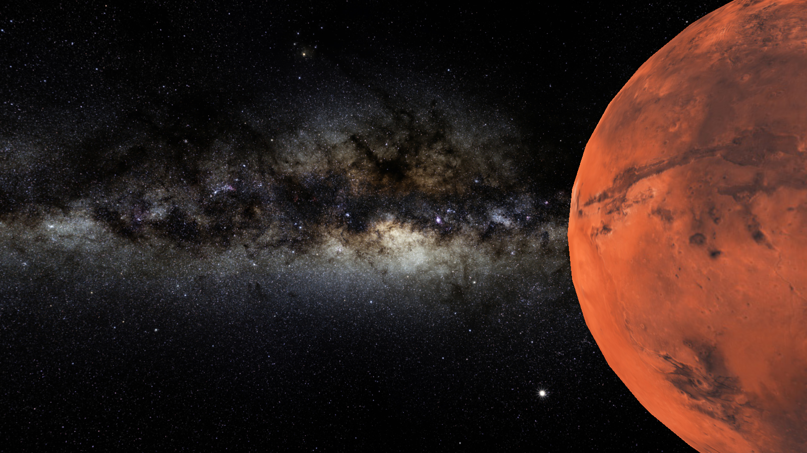

# Gravity Simulator

    

A 3D gravity simulator using OpenGL. 

## Download and Run
1. Clone the repository (`git clone git@github.com:gequalspisquared/gravity-simulator.git`), 
2. cd into `gravity-simulator`
3. enter `make run`.

## Dependencies
- OpenGL
- [GLAD](https://glad.dav1d.de/) (v4.6.0 Core or greater)
- [GLFW](https://www.glfw.org/)
- [GLM](https://github.com/g-truc/glm)
- [Assimp](https://github.com/assimp/assimp/blob/master/Build.md)

### Already Included
- [stb_image.h](https://github.com/nothings/stb/blob/master/stb_image.h)
